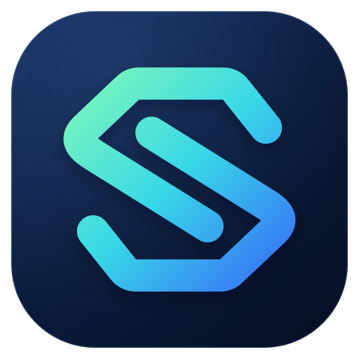

<div align="center">



# AIPC

[最新リリース](https://github.com/HeartEase1/aipc/releases/latest) · [ソースコード](https://github.com/HeartEase1/aipc) · [上流 Sub2API](https://github.com/Wei-Shaw/sub2api)

English: [README.md](README.md) · 中文: [README_CN.md](README_CN.md) · 日本語

</div>

## このプロジェクトについて

AIPC は Sub2API を基盤とする独立したコミュニティ保守のフォークです。上流プロジェクトによる公式リリースではなく、提携や公式な保証もありません。ゲートウェイの上流更新に追随しつつ、AIPC 独自のコンソール、管理・運用機能との互換性を維持します。

- モダンとクラシックの二つのコンソールを管理者が切り替えられます。
- 利用履歴、チャンネル監視、モデル価格カタログなどの運用情報を表示します。
- 残高チャージ、サブスクリプション、特典、割引などの機能を提供します。設定と課金条件は必ずリリースごとに確認してください。

機能、設定、移行時の注意点については [英語版 README](README.md) または [中国語版 README](README_CN.md) を参照してください。

## 導入

本番環境では PostgreSQL と Redis を使用する Docker Compose 構成を推奨します。最初にデータベースと設定ファイルをバックアップし、[AIPC のリリースノート](https://github.com/HeartEase1/aipc/releases) を確認してください。

```bash
git clone https://github.com/HeartEase1/aipc.git
cd aipc/deploy
cp .env.example .env
# .env 内のデータベースパスワードと秘密鍵を設定してから起動してください。
docker compose -f docker-compose.local.yml up -d
```

詳細な手順と既存の公式 Sub2API 環境からのデータ保持移行については、[デプロイガイド](deploy/README.md) と [Docker ガイド](deploy/DOCKER.md) を参照してください。既存環境との互換性のため、サービス名やバイナリ名には `sub2api` が残っていますが、イメージと更新元は AIPC です。

## 注意事項

各上流サービスの利用規約と適用法令を確認してください。アカウント停止、サービス中断、データ損失などのリスクを理解したうえで利用し、アップグレード前にはデータベースと設定をバックアップしてください。

## ライセンスと帰属

AIPC は [LGPL-3.0 ライセンス](LICENSE)に従います。元プロジェクトへの帰属情報は維持します。
