# AIPC 使用教程

本教程介绍从创建 API 密钥、配置接口地址，到使用 CC-Switch 或 Cockpit Tools 快速接入 Codex、Claude Code Desktop 等工具的完整流程。

> 本站参数以本页为准。API 密钥属于敏感信息，请勿公开分享、上传到公共代码仓库，或在截图、聊天和工单中展示完整内容。

## 一、使用流程

### 1. 创建 API 密钥

登录后台后，在控制台左侧点击 **API 密钥**，进入密钥管理页面，然后点击右上角或空状态区域中的 **创建密钥**。

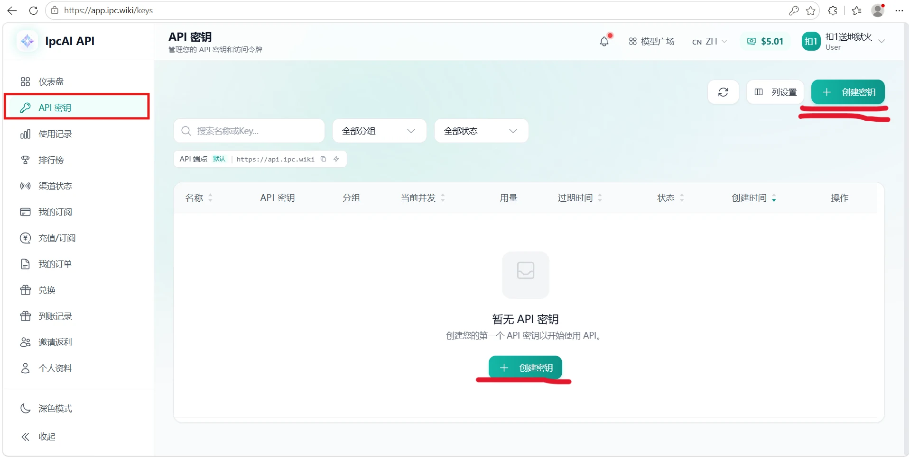

在创建弹窗中完成以下设置：

1. **名称**：填写一个便于识别的名称。
2. **分组**：选择需要使用的模型分组。
3. 其他限制项可按需配置；确认无误后点击右下角 **创建**。


创建成功后，列表中的 **API 密钥** 即为后续配置需要使用的 Key。页面同时提供接口地址复制和 **导入到 CCS** 操作。

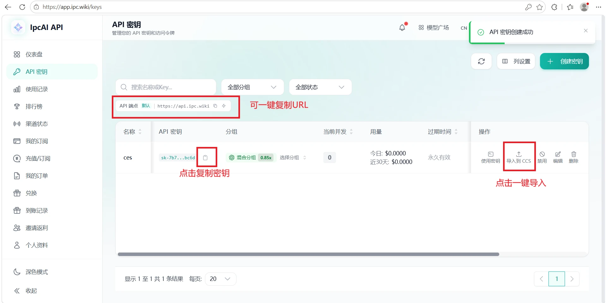

> 请妥善保管 API 密钥。创建后建议立即保存，完整密钥通常只显示一次。

### 2. 配置接口地址

在需要接入的工具或项目中填写中转站提供的接口地址和刚刚创建的 API 密钥：

```text
Base URL: https://api.ipc.wiki
API Key: sk-xxxxxxxxxxxxxxxx
```

### 3. 使用 CC-Switch

为了让配置过程更轻便、简单，推荐使用 GitHub 开源项目 **CC-Switch** 管理使用环境。

- CC-Switch 官网：[https://ccswitch.io/zh/](https://ccswitch.io/zh/)

#### 推荐方式：直接导入 CCS

推荐新手使用一键导入。在 API 密钥列表中点击 **导入到 CCS**，导入完成后重启 Codex、Claude Code 等软件即可，无需手动填写下面的参数。


#### 手动配置

打开 CC-Switch，选择需要配置的模型或程序图标，然后点击右上角的 **+**。


在供应商列表中选择对应程序。不同程序的字段可能略有差异，但整体步骤一致；需要完全手动填写时可选择 **自定义配置**。

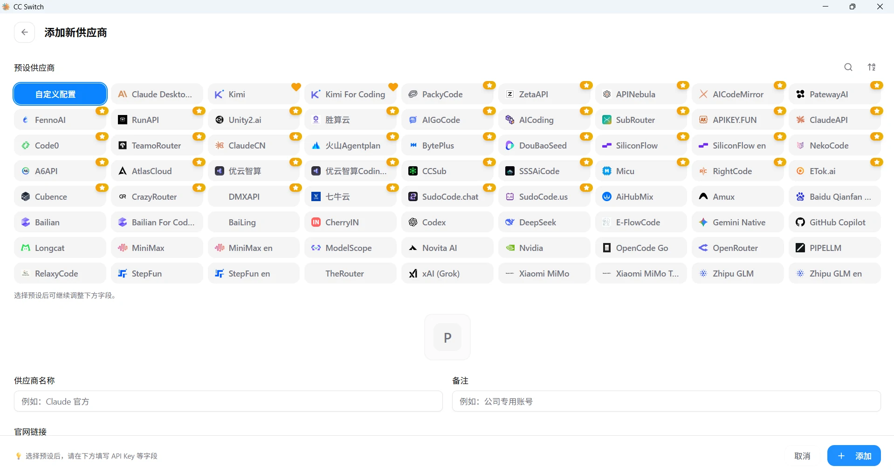

根据页面提示填写供应商参数：

- **供应商名称**：`AIPC`
- **官网链接**：`https://api.ipc.wiki`
- **API Key**：填写本教程第 1 步创建的密钥
- **请求地址**：`https://api.ipc.wiki`
- 请求地址末尾**不要添加斜杠**
- 点击 **添加**，新配置默认处于启用状态

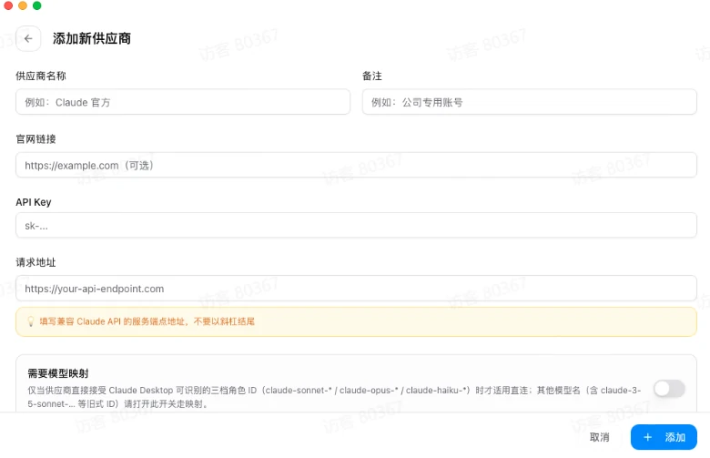

可以添加多个密钥，添加后任意启用其中一个即可。切换启用项后，对应的模型 Agent 需要重启，以确保最新密钥生效，例如 Codex、Claude Code 等。

## 二、Cockpit Tools：下载与一键配置

本节提供 Cockpit Tools 官方安装包，并通过实际截图说明如何结合 AIPC 配置 Codex 与 Claude Code Desktop。两种客户端的地址填写方式不同，请按对应小节操作。

### 1. 下载 Cockpit Tools

| 系统 | 安装包 |
| --- | --- |
| Windows x64 | [下载 Cockpit Tools 1.3.1 MSI](https://github.com/jlcodes99/cockpit-tools/releases/download/v1.3.1/Cockpit.Tools%5F1.3.1%5Fx64%5Fen-US.msi) |
| macOS（Intel 与 Apple Silicon） | [下载 Cockpit Tools 1.3.1 通用版 DMG](https://github.com/jlcodes99/cockpit-tools/releases/download/v1.3.1/Cockpit.Tools%5F1.3.1%5Funiversal.dmg) |

- 官方发布页：[Cockpit Tools v1.3.1](https://github.com/jlcodes99/cockpit-tools/releases/tag/v1.3.1)

首次安装若被系统拦截，请先核对下载来源、版本号和文件名。以上链接均指向 Cockpit Tools v1.3.1 官方 GitHub Release。

### 2. 使用 Cockpit 配置 Codex

Codex 使用 OpenAI 兼容接口，因此 Cockpit 的基础地址必须填写：

```text
https://api.ipc.wiki/v1
```

以下图片中的红色和蓝色箭头标出了每一步需要点击或填写的位置。

#### 步骤 1：复制 AIPC API 密钥

打开 AIPC **API 密钥** 页面，确认密钥处于活跃状态并绑定 OpenAI 平台分组，然后点击复制图标。完整密钥不要出现在截图、聊天或工单中；Codex 地址使用带 `/v1` 的端点。


#### 步骤 2：添加 Codex 账号

打开 Cockpit Tools，在左侧点击 **Codex** 进入账号总览，再点击右上角 **+**。


#### 步骤 3：选择 API Key

在“添加 Codex 账号”弹窗中选择 **API Key**。本流程不使用 OAuth，也不使用 Token 或 JSON 导入。

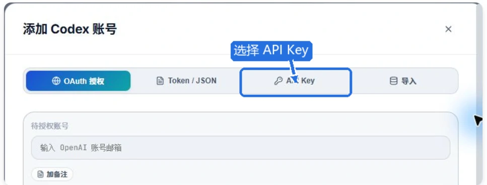

#### 步骤 4：选择自定义供应商

在供应商区域选择 **自定义**，这样才能填写 AIPC 的 API 地址。

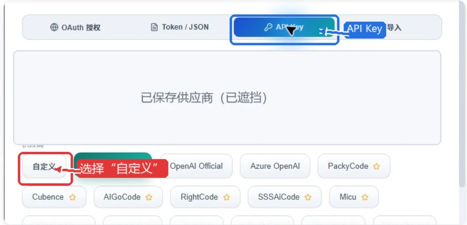

#### 步骤 5：填写连接参数

- **API Key**：粘贴 AIPC 密钥
- **基础地址**：`https://api.ipc.wiki/v1`
- **供应商名称**：`AIPC`

核对后点击 **添加账号**。密钥输入框应始终保持隐藏。

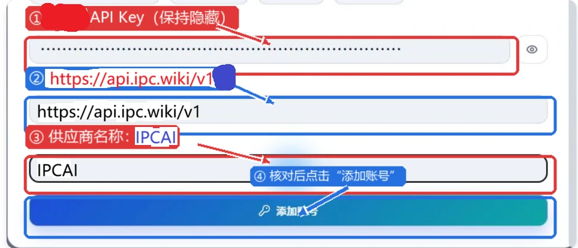

#### 步骤 6：切换到 AIPC 账号

确认账户卡片显示供应商 AIPC 和正确的基础地址；若尚未生效，点击卡片底部 **切换**。API Key 账户显示“OAuth 未绑定”属于正常现象。

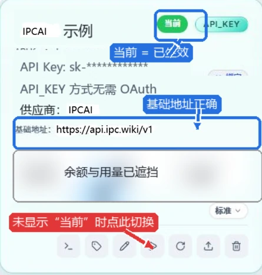

完成后完全退出并重新打开 Codex，发送一条简单测试消息；同时可在 AIPC **使用记录**中确认请求已经到达。

### 3. 使用 Cockpit 配置 Claude Code Desktop

这里配置的是 Claude 桌面版中的 **Code（Claude Code Desktop）**，不是 Claude Code CLI。正确路径是：

```text
Cockpit Tools → Claude → 顶部“Claude” → + → 网关 → 自定义
```

> 地址区别非常重要：Claude Desktop Gateway 的 Base URL 填写 `https://api.ipc.wiki`，**不要添加 `/v1`**；Claude Desktop 会自行请求 `/v1/messages`。认证方式选择 `bearer`。

#### 步骤 1：添加 Claude 账号

打开 Cockpit Tools，左侧点击 **Claude**，保持页面顶部选中 **Claude**（不要选择“Claude CLI”），再点击右上角 **+**。

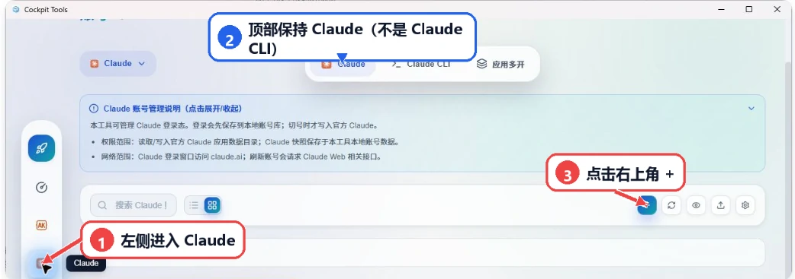

#### 步骤 2：选择网关

在添加账号窗口选择 **网关**，不要选择 OAuth 登录。

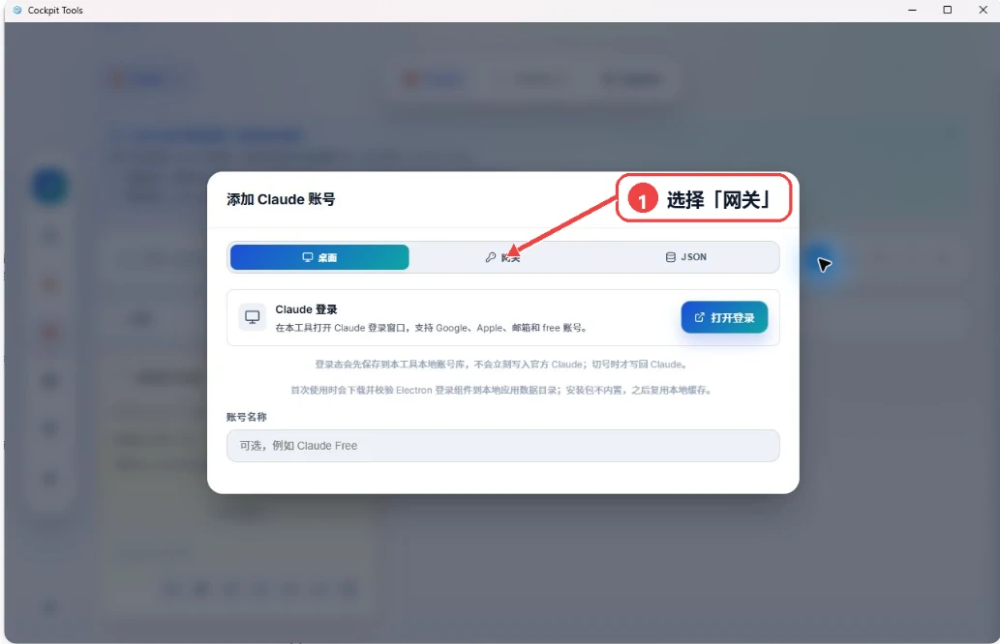

#### 步骤 3：选择自定义供应商

进入网关后，在供应商列表选择 **自定义**。

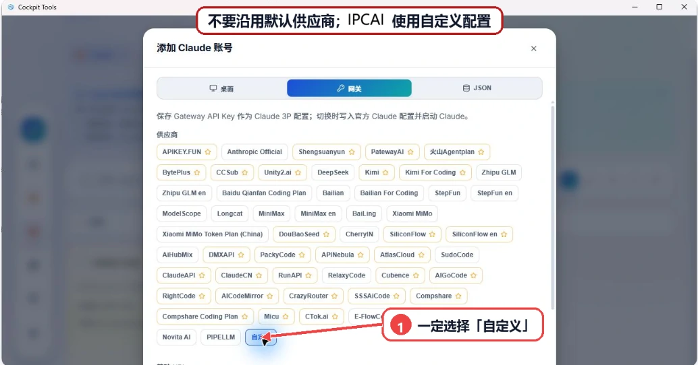

#### 步骤 4：填写 Base URL 和认证方式

- **Base URL**：`https://api.ipc.wiki`
- **认证方式**：`bearer`

这里不要添加 `/v1`，否则 Claude Desktop 可能拼出重复路径。

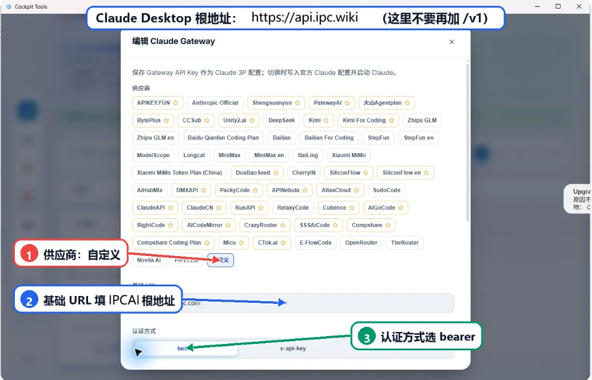

#### 步骤 5：导入 Gateway

名称填写 `AIPC`，粘贴 AIPC API Key，等待 Cockpit 自动读取模型列表；确认模型出现后点击 **导入 Gateway**。首次添加时按钮显示“导入 Gateway”，编辑已有账号时会显示“保存 Gateway”。

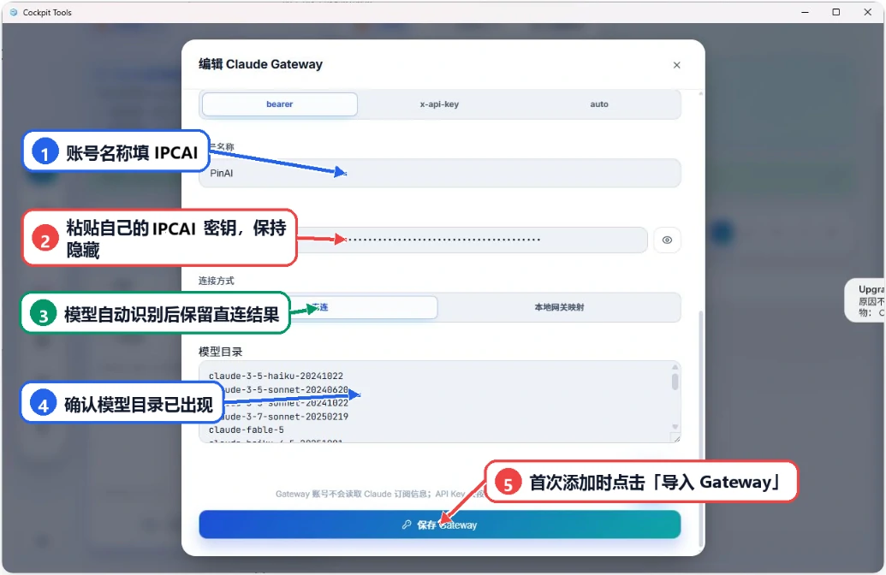

#### 步骤 6：应用供应商配置

回到 AIPC 账号卡片，点击卡片上的三角形按钮。看到“已应用 Claude Desktop 供应商配置：AIPC”后，Cockpit 会应用配置并启动或重启 Claude Desktop；三角形按钮才是一键配置入口。

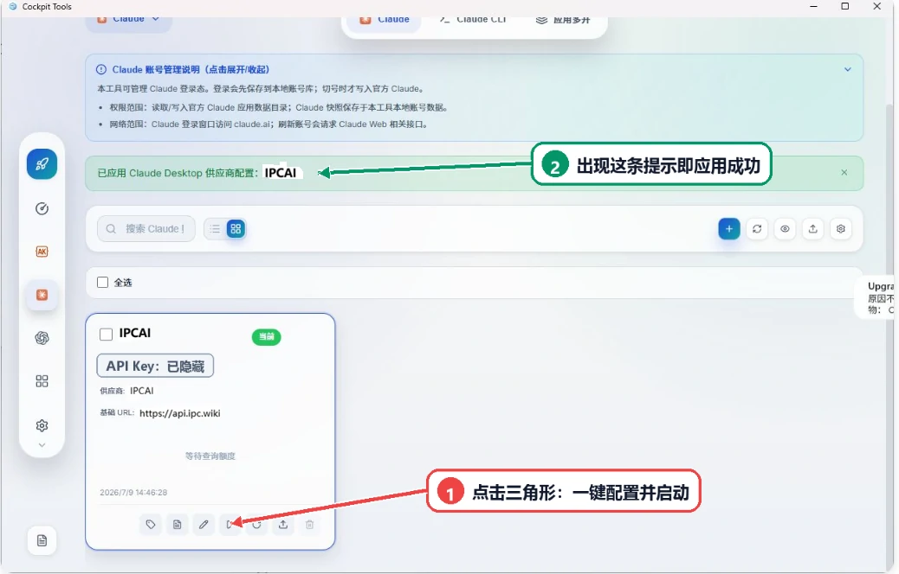

#### 步骤 7：发送测试消息

Claude 自动打开后进入 **Code** 标签页，底部供应商应显示 Gateway。发送测试消息，并在 AIPC **使用记录**中核对请求。

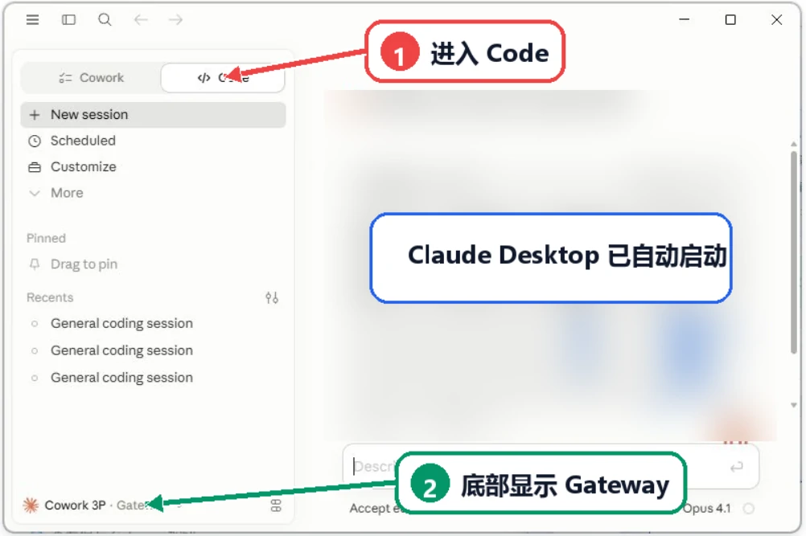

### 4. 使用 Cockpit 恢复 Codex 对话

此功能用于恢复 Codex 本地会话，不适用于 Claude 或 Claude Code Desktop。入口为：

```text
Cockpit Tools → Codex → 顶部“会话管理”
```

#### 场景一：切换账号后原对话不再显示

原对话通常仍保存在磁盘中，可按以下步骤修复可见性。

1. **进入会话管理**：左侧选择 Codex，再点击顶部 **会话管理**；在工具栏点击 **修复可见性**。

   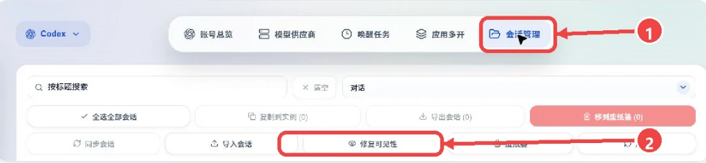

2. **选择修复范围**：日常切号优先选择 **快速修复**，目标实例保持默认，实例范围选择“仅目标实例”，会话范围选择“全部会话”；仅修复勾选项目时改选“所选会话”。

   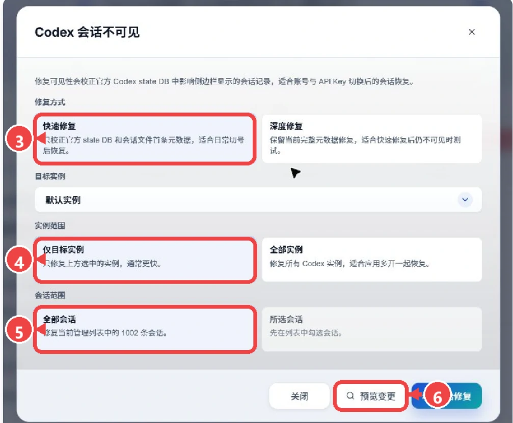

3. **预览并确认**：先点击 **预览变更**，核对将处理的实例、会话和 SQLite 记录。确认无误后，右下角按钮会显示 **确认修复**，再点击执行；未预览时按钮显示“开始修复”。

   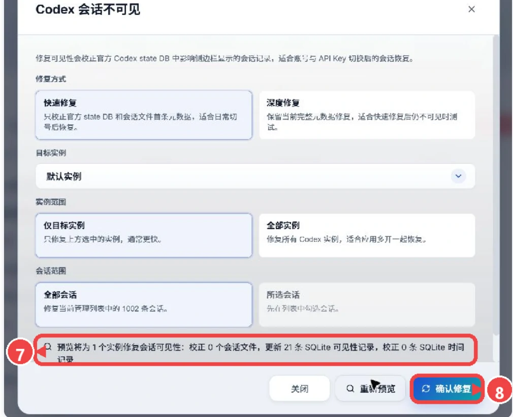

4. **重启并复查**：修复完成后重新打开 Codex；若快速修复后仍不显示，再尝试 **深度修复**。多开实例需要一起恢复时，实例范围可改为“全部实例”。

修复可见性会校正官方 Codex state DB 与会话元数据，并在写入前创建备份。深度修复会扫描 rollout、`session_index.jsonl` 和 SQLite 索引，只建议在快速修复无效时使用。

#### 场景二：会话被移入 Cockpit 废纸篓

1. 在 **会话管理**顶部点击 **恢复会话**，打开废纸篓。
2. 勾选需要找回的会话，点击 **恢复选中会话**。
3. 会话会恢复到原来的 Codex 实例；完成后重新打开 Codex 检查。

> 永久删除或清空废纸篓后无法恢复。缺失或损坏的 rollout 文件不能凭空重建；损坏的 SQLite 会被跳过，可能需要先由 Codex 重建；运行中的实例可能需要重启后才显示。遇到相同会话 ID 时会安全跳过，不会覆盖不同会话。

### 5. Cockpit 常见问题

- Gateway 账号不显示 Claude 官方订阅额度属于正常现象，以 Claude 实际调用和 AIPC 使用记录为准。
- 本地网关映射模式需要 Cockpit 保持运行；退出 Cockpit 后若无法调用，请重新打开 Cockpit。
- Windows 首次提示应用路径时，应选择 Microsoft Store 安装的 Claude 或真实的 `Claude.exe`，不要选择 Claude Code CLI。
- 不要点击密钥输入框右侧的眼睛图标；截图、录屏和远程协助时始终保持密钥遮挡。
- 如模型列表加载失败，先检查密钥状态、分组、余额和网络，再确认 Base URL 是否错误添加了 `/v1`。

## 三、核心优势

### 1. 成本更低

GPT 模型支持约 0.2 倍率，适合日常测试、开发调试和高频轻量使用，具有较高性价比。后续还会引入高倍率 GPT；目前已经接入 CC，倍率适中，也可按需使用。

### 2. 支持退款

本团队不强求充值。充值后如认为服务不达预期，充值部分余额（不含赠费）可凭合理理由申请退款。

> 高性价比 GPT 模型以成本优势为主，速度和稳定性可能与高倍率模型存在差异，请根据实际场景选择。

### 3. 场景灵活

可用于文案生成、代码辅助、资料整理、AI 聊天助手、知识库问答、自动化工作流等场景。

### 4. 使用方便

统一管理 API Key、模型调用和使用额度，方便个人或团队进行测试与接入。

## 四、支付说明

目前充值比例为 **1:10**，即 1 元人民币等同于 10 美元平台额度。

- 使用支付宝或微信支付时如未弹出支付页面，请先关闭代理后重试。
- 如已成功支付但余额未到账，请第一时间联系客服。

## 五、搜索关键词与参考资料

### 搜索关键词

如需查看第三方图文教程，可搜索以下关键词：

- Codex CLI 配置第三方 API Base URL 教程
- Codex CLI `OPENAI_BASE_URL` 自定义 API
- Claude Code `ANTHROPIC_BASE_URL` 中转教程
- Claude Code 第三方 API 配置 Windows
- Cursor OpenAI Compatible Base URL API Key
- OpenClaw `custom-api-key` `custom-base-url` 教程
- OpenClaw 自定义 Provider OpenAI compatible

### 公开教程与文档

下面的公开资料可用于补充软件界面和高级参数说明，本站参数仍以本页为准。

- [Codex 官方高级配置](https://developers.openai.com/codex/config-advanced)
- [Codex 官方配置参考](https://developers.openai.com/codex/config-reference)
- [Claude Code 认证说明](https://code.claude.com/docs/en/authentication)
- [Claude Code LLM Gateway](https://code.claude.com/docs/en/llm-gateway)
- [Claude Code 环境变量](https://code.claude.com/docs/en/env-vars)
- [OpenClaw 官方文档](https://docs.openclaw.ai)
- 可搜索参考：CSDN「Codex CLI 配置第三方 API 完全指南」
- 可搜索参考：SegmentFault「Claude Code 接入第三方 API 中转服务配置教程」
- 可搜索参考：博客园「使用自定义 API 接入 OpenAI Codex 配置教程」

## 六、使用前确认

- API 密钥必须处于启用状态。
- API 密钥需要绑定 OpenAI 平台分组。
- 账户余额、订阅、额度、并发和 IP 限制需要处于可用状态。
- 使用图片生成时，后台需要有可用的 OpenAI 图片上游账号。
- 对外只发送 AIPC API 密钥，不发送上游账号凭据。
- 批量调用前建议先用小额度密钥试跑，确认价格、额度、返回格式和超时设置符合预期。

## 七、常见错误

| 返回状态 | 常见原因 | 处理方式 |
| --- | --- | --- |
| `401` | 未传 API 密钥，或密钥无效 | 检查 `Authorization: Bearer ...`。 |
| `403` | 用户余额不足、密钥过期或权限不满足 | 充值、续期或重新创建密钥。 |
| `404` | API 密钥绑定的分组不是 OpenAI 平台 | 为该密钥绑定 OpenAI 平台分组。 |
| `429` | 额度、频率或并发达到限制 | 降低调用频率，或调整额度和并发。 |
| `503` | 暂无可用图片上游账号 | 联系管理员检查 OpenAI 图片账号和调度状态。 |

## 八、安全与常见问题

- API 密钥和配置脚本都是敏感材料，不要公开传播。
- 创建密钥后请立即保存；完整密钥通常只显示一次。
- 配置脚本会备份旧配置，优先使用脚本恢复，不要手工删除 `.codex`、`.claude` 或 OpenCode 配置目录。
- 如果配置成功后客户端仍使用旧账号或旧模型，请关闭并重新打开客户端。
