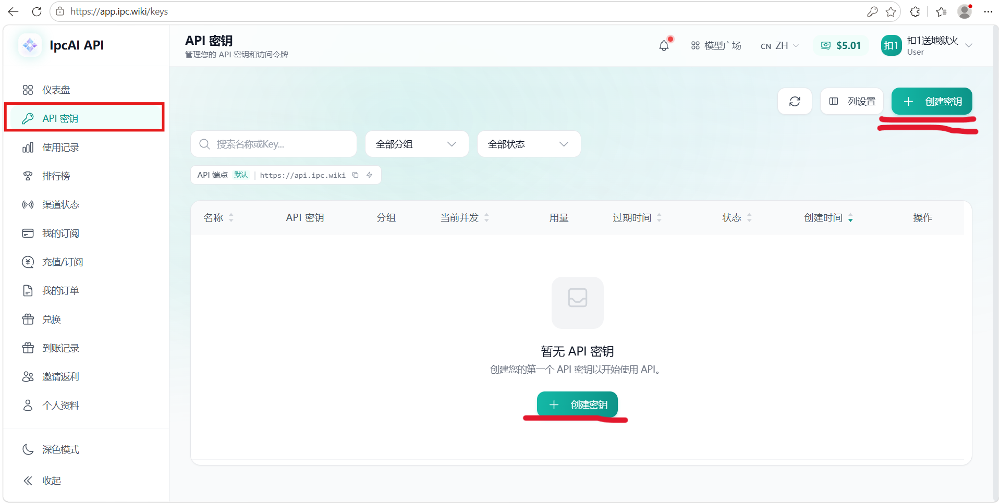
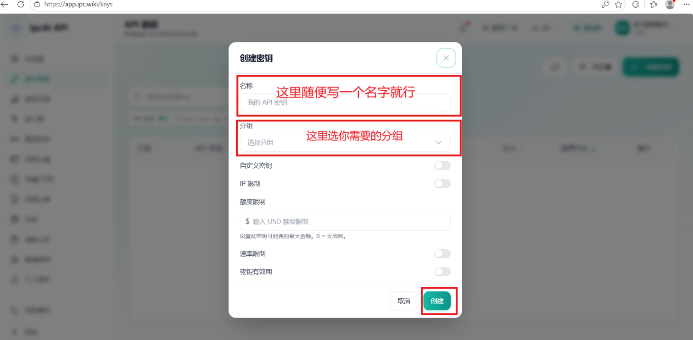
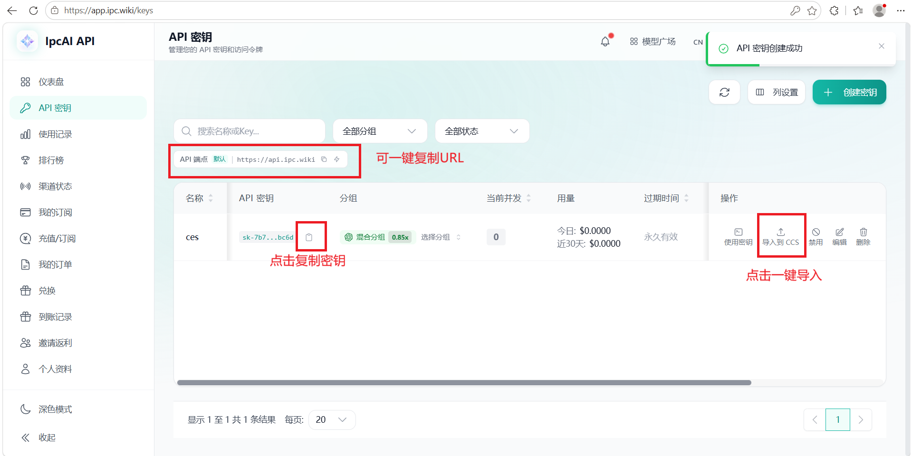
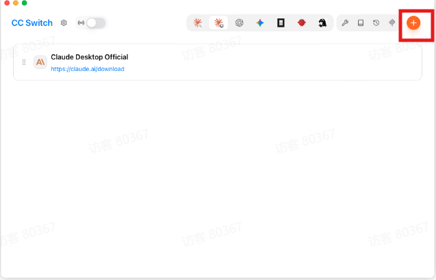
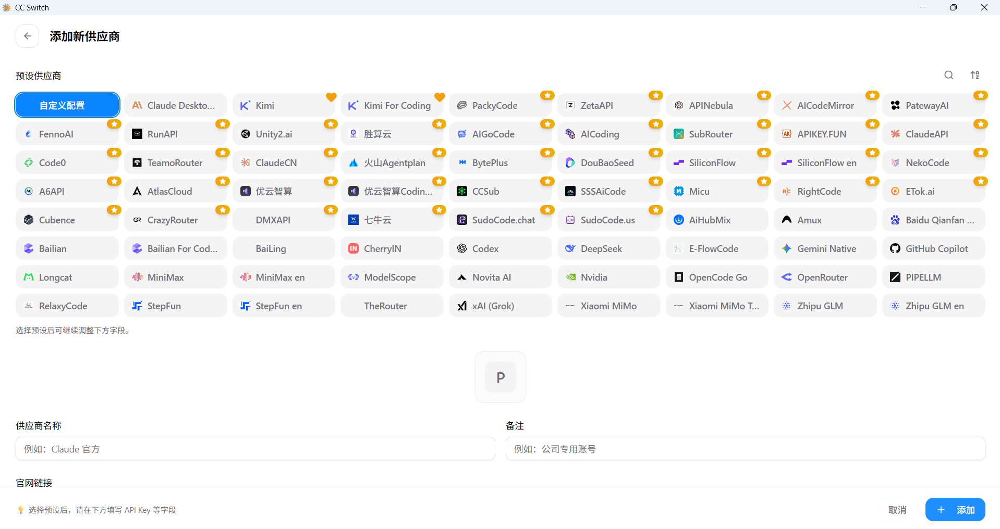
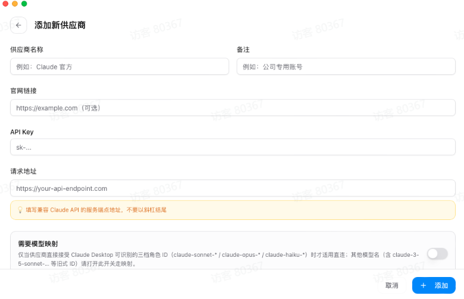

# IPCAI 使用教程

本教程介绍从创建 API 密钥、配置接口地址，到使用 CC-Switch 快速接入 Codex、Claude Code 等工具的完整流程。

> 本站参数以本页为准。API 密钥属于敏感信息，请勿公开分享或上传到公共代码仓库。

## 一、使用流程

### 1. 创建 API 密钥

登录后台后，在控制台左侧点击 **API 密钥**，进入密钥管理页面。点击右上角或空状态区域中的 **创建密钥**。



在创建弹窗中完成以下设置：

1. **名称**：填写一个便于识别的名称即可。
2. **分组**：选择你需要使用的模型分组。
3. 其他限制项可按需配置；确认无误后点击右下角 **创建**。



创建成功后，列表中的 **API 密钥** 即为后续配置需要使用的 Key。页面同时提供接口地址复制和 **导入到 CCS** 操作。



> 请妥善保管 API 密钥。创建后建议立即保存，完整密钥通常只显示一次。

### 2. 配置接口地址

在需要接入的工具或项目中填写中转站提供的接口地址和刚刚创建的 API 密钥：

```text
Base URL: https://api.ipc.wiki
API Key: sk-xxxxxxxxxxxxxxxx
```

### 3. 选择配置工具 CC-Switch

为了让配置过程更轻便、简单，推荐使用 GitHub 开源项目 **CC-Switch** 管理使用环境。

- CC-Switch 官网：[https://ccswitch.io/zh/](https://ccswitch.io/zh/)

### 4. 使用 CC-Switch

#### 推荐方式：直接导入 CCS

推荐新手使用一键导入。在 API 密钥列表中点击 **导入到 CCS**，导入完成后重启 Codex、Claude Code 等软件即可，无需手动填写下面的参数。


#### 手动配置

打开 CC-Switch，选择需要配置的模型或程序图标，然后点击右上角的 **+**。



在供应商列表中选择对应程序。不同程序的字段可能略有差异，但整体步骤一致；需要完全手动填写时可选择 **自定义配置**。



根据页面提示填写供应商参数：

- **供应商名称**：`IPCAI`
- **官网链接**：`https://api.ipc.wiki`
- **API Key**：填写本教程第 1 步创建的密钥
- **请求地址**：`https://api.ipc.wiki`
- 请求地址末尾**不要添加斜杠**
- 点击 **添加**，新配置默认处于启用状态



可以添加多个密钥，添加后任意启用其中一个即可。切换启用项后，对应的模型 Agent 需要重启，以确保最新密钥生效，例如 Codex、Claude Code 等。

## 二、核心优势

### 1. 成本更低

GPT 模型支持约 0.2 倍率，适合日常测试、开发调试和高频轻量使用，具有较高性价比。后续还会引入高倍率 GPT；目前已经接入 CC，倍率适中，也可按需使用。

### 2. 支持退款

本团队不强求充值。充值后如认为服务不达预期，充值部分余额（不含赠费）可凭合理理由申请退款。

> 高性价比 GPT 模型以成本优势为主，速度和稳定性可能与高倍率模型存在差异，请根据实际场景选择。

### 3. 场景灵活

可用于文案生成、代码辅助、资料整理、AI 聊天助手、知识库问答、自动化工作流等场景。

### 4. 使用方便

统一管理 API Key、模型调用和使用额度，方便个人或团队进行测试与接入。

## 支付说明

目前充值比例为 **1:10**，即 1 元人民币等同于 10 美元平台额度。

- 使用支付宝或微信支付时如未弹出支付页面，请先关闭代理后重试。
- 如已成功支付但余额未到账，请第一时间联系客服。

## 搜索关键词与参考资料

### 搜索关键词

如需查看第三方图文教程，可搜索以下关键词：

- Codex CLI 配置第三方 API Base URL 教程
- Codex CLI `OPENAI_BASE_URL` 自定义 API
- Claude Code `ANTHROPIC_BASE_URL` 中转教程
- Claude Code 第三方 API 配置 Windows
- Cursor OpenAI Compatible Base URL API Key
- OpenClaw `custom-api-key` `custom-base-url` 教程
- OpenClaw 自定义 Provider OpenAI compatible

### 公开教程与文档

下面的公开资料可用于补充软件界面和高级参数说明，本站参数仍以本页为准。

- [Codex 官方高级配置](https://developers.openai.com/codex/config-advanced)
- [Codex 官方配置参考](https://developers.openai.com/codex/config-reference)
- [Claude Code 认证说明](https://code.claude.com/docs/en/authentication)
- [Claude Code LLM Gateway](https://code.claude.com/docs/en/llm-gateway)
- [Claude Code 环境变量](https://code.claude.com/docs/en/env-vars)
- [OpenClaw 官方文档](https://docs.openclaw.ai)
- 可搜索参考：CSDN「Codex CLI 配置第三方 API 完全指南」
- 可搜索参考：SegmentFault「Claude Code 接入第三方 API 中转服务配置教程」
- 可搜索参考：博客园「使用自定义 API 接入 OpenAI Codex 配置教程」

## 使用前确认

- API 密钥必须处于启用状态。
- API 密钥需要绑定 OpenAI 平台分组。
- 账户余额、订阅、额度、并发和 IP 限制需要处于可用状态。
- 后台需要有可用的 OpenAI 图片上游账号。
- 对外只发送 IPCAI API 密钥，不发送上游账号凭据。
- 批量调用前建议先用小额度密钥试跑，确认价格、额度、返回格式和超时设置符合预期。

## 常见错误

| 返回状态 | 常见原因 | 处理方式 |
| --- | --- | --- |
| `401` | 未传 API 密钥，或密钥无效 | 检查 `Authorization: Bearer ...`。 |
| `403` | 用户余额不足、密钥过期或权限不满足 | 充值、续期或重新创建密钥。 |
| `404` | API 密钥绑定的分组不是 OpenAI 平台 | 为该密钥绑定 OpenAI 平台分组。 |
| `429` | 额度、频率或并发达到限制 | 降低调用频率，或调整额度和并发。 |
| `503` | 暂无可用图片上游账号 | 联系管理员检查 OpenAI 图片账号和调度状态。 |

## 安全与常见问题

- API 密钥和配置脚本都是敏感材料，不要公开传播。
- 创建密钥后请立即保存；完整密钥通常只显示一次。
- 配置脚本会备份旧配置，优先使用脚本恢复，不要手工删除 `.codex`、`.claude` 或 OpenCode 配置目录。
- 如果配置成功后客户端仍使用旧账号或旧模型，请关闭并重新打开客户端。
